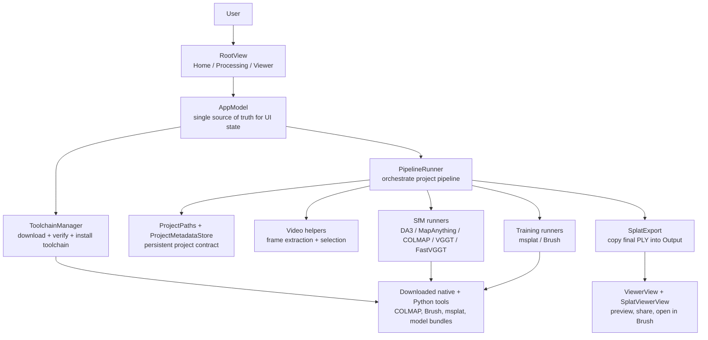
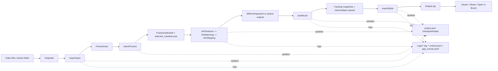

# EasySplat Onboarding

Maintainer architecture guide for contributors, technical power users, and anyone trying to understand what this repository actually does.

If this file and the code disagree, trust the code. This guide is meant to shorten the time it takes to build a correct mental model, not replace source-level truth.

Use `README.md` for the concise operational entry point and copy-paste commands. Use this document when you need the deeper architecture, persistence, pipeline, and release model.

## What EasySplat Is

EasySplat is a macOS desktop app for Apple Silicon Macs. Its job is simple to describe and fairly involved to implement:

1. Take a video, a folder of photos, or both.
2. Reconstruct camera poses and sparse geometry.
3. Train a Gaussian splat representation.
4. Export a `.ply` file that the app can preview, share, or hand off to Brush.

The app is intentionally beginner-friendly. The repository is not. Under the surface, it is a production-oriented wrapper around a downloaded toolchain of native binaries, Python environments, large model bundles, and a resumable project format.

### Who This Repo Serves

| Audience | What they care about |
| --- | --- |
| End users | Drag in a video or photo folder, wait, get a splat. |
| Power users | Override backends, use local toolchains, inspect logs, skip training, package local builds. |
| Engineers | Keep the UI approachable while maintaining a reliable long-running pipeline with good state, logs, recovery, and release automation. |

### Five Things To Know Up Front

1. `EasySplatApp` is intentionally thin. `EasySplatCore` does the real work.
2. The app does not ship the full toolchain in the repo or app bundle by default. It downloads a signed manifest and installs toolchain artifacts into Application Support.
3. Every run lives inside a `.easysplatproj` directory bundle under `~/Documents/EasySplat Projects/`.
4. The default Fast app profile uses COLMAP `global_mapper`; Balanced and Ultra runs start with DA3 and fall back when needed.
5. The UI is designed for absolute beginners: sparse layout, one obvious primary action, calm feedback, minimal jargon.

## At A Glance

| Topic | Current answer |
| --- | --- |
| Platform | macOS 15+ on Apple Silicon |
| Package type | Swift Package Manager repo with an executable app target and a core library target |
| App stack | SwiftUI with a small amount of AppKit glue |
| Core stack | Swift 6, Foundation, CryptoKit, ImageIO, SQLite3, subprocess orchestration |
| Viewer | `MetalSplatter` + `SplatIO` from `ThirdParty/MetalSplatter` |
| Default SfM path | Fast uses COLMAP `global_mapper`; Balanced and Ultra start DA3-first with MapAnything/COLMAP fallback |
| Legacy / override paths | `mapanything`, `colmap`, `glomap` / `global_mapper`, `vggt`, `fastvggt` |
| Output | A Gaussian splat PLY plus project metadata and logs |
| Project persistence | `project.json`, stage checkpoints, log files, app events, share metrics, training snapshots, output files inside a `.easysplatproj` bundle |
| Toolchain trust model | Ed25519-signed manifest, SHA-256 artifact checks, expected-content validation |
| Test focus | Heavy coverage in `EasySplatCoreTests`; light app tests; SwiftPM UI tests are placeholder-only |

## What The App Feels Like

EasySplat is not styled like a research demo. It is styled like a calm macOS utility that happens to run an advanced 3D reconstruction pipeline.

The user-facing product has three main screens:

- **Home**: choose input, choose capture mode and speed/quality profile, see prior projects.
- **Processing**: watch stage progress, inspect details and logs, optionally see a live training preview.
- **Viewer**: preview the final splat, share it, reveal it in Finder, or open it in Brush.

The core UX promise is: simple surface, rich feedback. The app hides most technical complexity until the user needs it.

## End-To-End User Journey

### 1. Input selection

From the Home screen the user can:

- drag in video files,
- drag in a folder of images,
- choose videos through a file importer,
- choose a photos folder through a file importer,
- or reopen an existing project from the project list.

Internally, `AppModel` turns that into an `InputSpec`:

- `.video(files: [String])`
- `.photos(folder: String)`
- `.mixed(videos: [String], photosFolder: String)`

It also captures the user-facing preset:

- `CaptureMode`: `object` or `room`
- `QualityPreset`: `draft` (shown as Fast), `standard` (shown as Balanced), or `ultra`

### 2. Project creation

When the user presses Start, the app creates a directory bundle under:

```text
~/Documents/EasySplat Projects/<Title>.easysplatproj/
```

If a project with that name already exists, the app appends a short UUID suffix.

This bundle is the durable unit of work. If you remember one storage concept in this repo, remember this one.

### 3. Toolchain resolution

Before the pipeline runs, the app ensures a valid toolchain is installed.

By default:

- the manifest URL comes from `EasySplatApp/Resources/toolchain_manifest_url.txt` or a built-in GitHub Releases URL,
- the public key comes from `EasySplatApp/Resources/public_key_ed25519.txt`,
- and the installed toolchain lives under:

```text
~/Library/Application Support/EasySplat/Toolchains/<version>/
```

For local development, the process can be overridden by environment variables or a local toolchain root.

### 4. Pipeline execution

`PipelineRunner` executes the stage machine:

1. Import input
2. Extract frames
3. Select frames
4. Find features
5. Match views
6. Solve cameras
7. Train Brush
8. Export splat
9. Mark done

Progress and logs are streamed back to the app as `PipelineEvent` values.

### 5. Result viewing and sharing

Once the exported PLY exists, the app switches to the Viewer screen:

- preview with MetalSplatter,
- share via `NSSharingServicePicker`,
- reveal in Finder,
- optionally open in Brush.

The project bundle remains on disk so the result can be reopened later. Share attempts append structured records to `Logs/app_events.jsonl`, and aggregate share metrics are stored back into `project.json`.

### 6. Recovery behavior

If the app is interrupted during most stages, it can usually resume from checkpoints after validating the expected outputs.

On relaunch, the Home screen can surface an interrupted-project prompt for work that has checkpoint evidence but no final output. The user can resume, dismiss the prompt for later, or delete the interrupted bundle; the suppression state is persisted in project metadata.

Important exception:

- during Brush training, stopping exports a snapshot only;
- resuming later restarts training from scratch rather than continuing true incremental training.

That caveat is surfaced directly in the UI and matters a lot when you are debugging or changing stop/resume behavior.

## Architecture Diagram

If Mermaid rendering is unavailable, read this top to bottom: user input enters the SwiftUI app, `AppModel` coordinates state, `ToolchainManager` ensures tools, `PipelineRunner` executes work against a persistent project bundle, and the viewer renders the exported PLY.



## Pipeline And Data-Flow Diagram

If Mermaid rendering is unavailable, read left to right: media is copied into the project bundle, derived data accumulates there, checkpoints and logs are written throughout, and the final output PLY is what the viewer opens.



## Visual And Frontend Style

The UI style is defined formally in `STYLE_GUIDE.md`, but the high-level picture is easy to describe: EasySplat tries to feel calm, trustworthy, sparse, and native to macOS.

### Design philosophy

The style guide is built around a few blunt rules:

- keep the visible surface simple,
- invest in clear status feedback,
- use beginner-friendly copy,
- prefer consistency over novelty,
- avoid decorative noise,
- respect Reduce Motion everywhere.

This is not a flashy creator tool UI. It is closer to a polished setup assistant for a complicated workflow.

### Visual identity

| Area | Current rule |
| --- | --- |
| Color | Use `Theme` tokens only. No hard-coded view colors. |
| Accent | Blue for primary action and active state |
| Success | Green for completion / ready state |
| Surfaces | Native macOS control background styling |
| Borders | Subtle, low-contrast outlines rather than heavy shadows |
| Typography | System fonts only |
| Shape language | Continuous rounded rectangles |
| Motion | Short, subtle hover/press/reveal animation |
| Accessibility | Reduce Motion disables optional animation; status cannot rely on color alone |

Current theme tokens come from `EasySplatApp/UI/Theme/Theme.swift`:

| Token | Current value |
| --- | --- |
| `Theme.background` | `NSColor.windowBackgroundColor` |
| `Theme.surface` | `NSColor.controlBackgroundColor` |
| `Theme.border` | `Color.gray.opacity(0.3)` |
| `Theme.accent` | `Color.blue` |
| `Theme.success` | `Color.green` |
| `Theme.subtle` | `Color.secondary` |

Current motion tokens:

| Token | Current value |
| --- | --- |
| `Theme.Motion.hover` | `easeOut(duration: 0.12)` |
| `Theme.Motion.press` | `easeOut(duration: 0.08)` |
| `Theme.Motion.reveal` | `easeInOut(duration: 0.18)` |

Current radius tokens:

| Token | Current value |
| --- | --- |
| `Theme.Radius.button` | `10` |
| `Theme.Radius.card` | `14` |
| `Theme.Radius.dropZone` | `18` |

### Screen-specific style

#### Home screen

- Large title, one short supportive line.
- Big drop zone as the dominant surface.
- One primary action ("Choose Video...") and a quieter secondary action ("Choose Photos Folder...").
- Settings stay compact and adaptive with `ViewThatFits`.
- Existing projects are shown as clean cards with a status dot and a small action row.

#### Processing screen

- Left column is about status, timing, detail text, and logs.
- Right column is a stage stepper that stays visible.
- Errors are short and direct.
- The log drawer stays secondary and collapsed by default.
- During training, live preview is optional because it can slow the job down.

#### Viewer screen

- The splat preview is the focal point.
- Actions stay simple: Share, Show in Finder, Open in Brush, Start Another.
- Viewer controls are intentionally subtle.

### Copy style

The app uses plain language on purpose:

- "Drop a video or photos folder"
- "Start"
- "Show in Finder"
- "No projects yet."

This matters. If you add UI and the copy starts sounding like a research paper or a power-user CLI, you are going in the wrong direction.

## Repository Map

### Core product directories

| Path | Role |
| --- | --- |
| `EasySplatApp/` | SwiftUI app target, app state model, UI components, viewer wrappers, bundled manifest/public-key resources |
| `EasySplatCore/` | Pipeline orchestration, project persistence, toolchain management, video helpers, SfM runners, training/export logic |
| `EasySplatAppTests/` | App-level tests |
| `EasySplatCore/Tests/EasySplatCoreTests/` | Core tests, including subprocess mocks, pipeline tests, path rules, manifest/toolchain validation |
| `EasySplatUITests/` | Placeholder target under SwiftPM; real XCUITest would require an Xcode project |
| `ThirdParty/MetalSplatter/` | Vendored viewer dependency package |
| `Tools/ManifestTool/` | Swift CLI for key generation and manifest signing |
| `Tools/Da3Sfm/` | DA3 Python bridge package shipped inside the toolchain |
| `Tools/MapAnythingSfm/` | MapAnything Python fallback bridge package shipped inside the toolchain |
| `Tools/VggtSfm/` | Python bridge package shipped inside the toolchain |
| `Tools/FastVggtSfm/` | Python bridge package shipped inside the toolchain |
| `Toolchains/` | Local build outputs, signed manifest, and dev-only keys; generally gitignored |
| `scripts/` | Dev, test, toolchain-build, release, and benchmark scripts |
| `.github/workflows/` | CI and release automation |

### Other notable directories

These exist in the repo right now, but they are not the primary product surfaces:

| Path | Why it exists |
| --- | --- |
| `.research/` | Upstream or exploratory work used during backend/toolchain investigation |
| `research_papers/` | Notes and source material from research work |
| `build/`, `release/`, `.build/` | Generated outputs |
| `output/`, `tmp/` | Local working outputs, experiments, or temporary files |

Treat those as supporting context, not the main architecture.

## Package Structure

`Package.swift` is the root packaging definition and the main source of truth for targets.

### Products

| Product | Type | Notes |
| --- | --- | --- |
| `EasySplatCore` | library | Reusable core logic |
| `EasySplatApp` | executable | Main desktop app |

### Declared dependencies

| Dependency | Current role |
| --- | --- |
| `ThirdParty/MetalSplatter` | Active dependency for splat viewing and PLY loading |

## App Layer Deep Dive

### `EasySplatApp.swift`

This is the app entry point. It creates a single `@StateObject` `AppModel`, injects it into the view tree, and wires in `AppDelegate`.

At a high level:

- one model object owns the app state,
- one root view switches between screens,
- one application delegate handles quit behavior during long-running work.

### `RootView`

`RootView` is the app shell. It does very little, by design:

- chooses `HomeView`, `ProcessingView`, or `ViewerView` based on `AppModel.viewState`,
- animates screen changes with `Theme.Motion.reveal`,
- disables animation when Reduce Motion is enabled,
- applies global tint and background styling.

This is an important architectural signal: screen-level control flow is state-driven, not navigation-stack-driven.

### `AppModel`

`AppModel` is the single source of truth for the app.

It owns:

- screen state,
- pipeline stage and progress,
- status and detail text,
- log lines and error lines,
- toolchain availability,
- current project location,
- training consent flow,
- sharing state and share metrics,
- input selection,
- project summaries and recovery prompts,
- stop/quit/close-window coordination.

If you are trying to understand the behavior of the app as a user would experience it, start here.

It also acts as the seam between the app and the core library:

- it creates the project directory,
- it calls `ToolchainManager.ensureToolchain(...)`,
- it creates `PipelineRunner`,
- it forwards `PipelineEvent` values back into published UI state.

### `AppDelegate`

`AppDelegate` exists mainly to handle quit behavior during processing:

- if nothing is running, the app can terminate normally;
- if a project is in progress, the delegate asks the model whether to save, delete, or cancel;
- if the app is already stopping, it defers termination until the stop flow finishes.

This is small code with outsized importance. It protects project integrity during exits.

### Viewer wrapper

`EasySplatApp/Viewer/` wraps `MetalSplatter` and related sample renderer code so the app can preview exported PLYs without making the rest of the UI care about rendering details.

The viewer layer should stay a viewer layer. Business logic does not belong here.

## Core Layer Deep Dive

`EasySplatCore` is the real engine room of the repository.

### High-level responsibilities

| Area | Responsibility |
| --- | --- |
| `Pipeline/` | Orchestrate stage execution, retries, progress events, checkpoints, and logging |
| `Project/` | Define the persistent on-disk contract |
| `SfM/` | Wrap reconstruction backends and scoring logic |
| `Tools/` | Validate and install toolchains, run subprocesses, persist tool logs |
| `Video/` | Extract and choose frames from video inputs |
| `Training/` | Run splat training and handle trainer-specific quirks |
| `Viewer/` | Export helpers for final splat files |
| `Hardware/` | Detect machine capability and tune backend parameters |

### `PipelineRunner`

`PipelineRunner` is the main orchestrator. It is the most important class in the core layer.

Its job is not just "run tools." It also has to:

- create and validate required directories,
- load and save project metadata,
- emit structured progress events,
- write resume checkpoints,
- detect interruptions,
- validate partial outputs on resume,
- choose the right SfM path,
- adapt parameters based on hardware,
- retry some failure cases with safer settings,
- support "stop after SfM" and "skip training" development modes,
- export user-facing and debug-friendly failures.

If you are making a pipeline change, expect to touch `PipelineRunner`, its helpers, and tests.

### `PipelineEvent` and UI progress

The pipeline does not update the UI directly. It emits:

- `stageStarted`
- `stageProgress`
- `stageLog`
- `stageFinished`
- `pipelineFailed`

That event model is what lets the UI stay simple and the core stay testable.

### `ProjectPaths` and `ProjectMetadataStore`

These two types define the persistent project contract.

`ProjectPaths` provides canonical locations such as:

- `project.json`
- `Originals/`
- `Frames/raw/`
- `Frames/selected/`
- `SfM/colmap/database.db`
- `SfM/colmap/seed/0`
- `SfM/colmap/sparse/`
- `Training/`
- `Output/`
- `Logs/pipeline.log`
- `Logs/events.jsonl`
- `Logs/app_events.jsonl`
- tool-specific logs like `colmap.log`, `mapanything.log`, `brush.log`

`ProjectMetadataStore` owns JSON load/save behavior for `ProjectMetadata`, including ISO-8601 dates and sorted pretty-printed output.

If you ever find yourself hand-building project file paths or ad hoc JSON, stop and route it through these abstractions instead.

### On-disk project format

Typical project bundle layout:

```text
<Title>.easysplatproj/
  project.json
  Originals/
  Frames/
    raw/
    selected/
    selected_manifest.json
  SfM/
    colmap/
      database.db
      seed/
        0/
      sparse/
  Training/
  Output/
  Logs/
    pipeline.log
    events.jsonl
    app_events.jsonl
    colmap.log
    glomap.log
    da3.log
    mapanything.log
    vggt.log
    fastvggt.log
    brush.log
    msplat.log
```

The exact contents vary by backend and success/failure path, but that is the stable conceptual shape.

### `ProjectMetadata`

`project.json` stores more than just a title. It includes:

- project identity,
- creation time,
- input spec,
- preset spec,
- pipeline state,
- output metadata,
- checkpoint information,
- recovery prompt suppression,
- last run start time,
- share metrics,
- the accepted reconstruction summary (registered frames, points, observations, mean track length, mean reprojection error where the mapper measures one, mapper, captured-at),
- per-stage wall-clock timings,
- the AutoTuner snapshot (hardware tier + knobs picked for the run),
- a free-text notes field.

A sibling `last_opened.json` sidecar holds the user's last-opened timestamp. It lives outside `project.json` so the home-screen open stamp cannot clobber concurrent pipeline writes.

This is why EasySplat can behave like a document-style app even though it is not using AppKit document architecture.

## Toolchain Delivery, Validation, And Security

The toolchain system exists because the heavy dependencies are too large and too changeable to treat like ordinary app resources.

### Why the toolchain is external

The repo depends on:

- native binaries like COLMAP and Brush,
- Python runtimes,
- model weights,
- research code packaged into self-contained tool bundles.

Those assets are large, platform-specific, and more operationally sensitive than the Swift app itself.

### How it works

1. The app resolves a manifest URL and public key through `AppConfig`.
2. `ToolchainManager` downloads `manifest.json`.
3. The manifest is verified with an embedded Ed25519 public key.
4. The relevant artifact or artifacts are downloaded.
5. SHA-256 hashes are checked.
6. The archive contents are validated against an expected file list.
7. The toolchain is unpacked into a versioned Application Support directory.
8. The installed toolchain is validated before use.

### Important current details

- `AppConfig` resolves the manifest URL in this order: environment override, bundled resource, or a release URL derived from the configured project home URL. Production builds do not fall back to localhost.
- `AppConfig` resolves the project home URL in this order: `EASYSPLAT_PROJECT_HOME_URL`, bundled `project_home_url.txt`, then the default GitHub project URL.
- The manifest format supports a split toolchain: `macos-arm64-core` and `macos-arm64-models`.
- Backward compatibility for an older monolithic `macos-arm64` artifact still exists.
- Python SfM bundles include `build_info.json` so releases can be traced back to source/runtime/model metadata.
- `ToolchainManager` can fall back to cached tools when manifest download fails.
- `EASYSPLAT_LOCAL_TOOLCHAIN_ROOT` bypasses download/install and validates an already-present local toolchain.

### What lives in the toolchain

At minimum, the validated toolchain includes:

- `bin/colmap`
- `bin/brush` and `bin/brush.real`
- `bin/easysplat-train`, `bin/default.metallib`, and native msplat provenance and license files
- OpenSSL libraries
- `da3_mps/`
- `mapanything_mps/`
- `vggt_mps/`
- `fastvggt_mps/`

One subtle but useful detail: the packaged `brush` wrapper normalizes CLI differences across Brush versions so both `brush <dataset>` and `brush train <dataset>` style invocations can be handled.

### `ManifestTool`

`Tools/ManifestTool` is the small Swift CLI that:

- generates Ed25519 keypairs,
- computes artifact hashes and sizes,
- writes expected contents,
- signs manifests.

Most manifest construction and signing logic now lives in `ManifestToolCore`, which makes canonical signing behavior and argument validation directly testable.

The app and the manifest tool intentionally share the same data model shape so manifest production and manifest consumption stay aligned.

## SfM Backends And Pipeline Behavior

### Default backend behavior

EasySplat has two default lanes.

That means:

- the default Fast app profile uses COLMAP `global_mapper`;
- Balanced and Ultra runs start with DA3 on MPS using bundled Apache-2.0 `DA3-BASE` weights;
- `DA3-SMALL` is bundled as the low-memory fallback inside the DA3 bridge;
- DA3 sparse output is scored against the full selected image count before the pipeline accepts it;
- if DA3 fails or scores poorly, MapAnything takes over as the first fallback;
- if that still is not good enough, COLMAP mapper fallback can take over.

Explicit `EASYSPLAT_SFM_BACKEND` values still override these defaults.

### Backend overview

| Backend selector | Meaning |
| --- | --- |
| `da3` | Default non-fast integrated path |
| `mapanything` | First fallback and explicit override path |
| `colmap` | Legacy integrated COLMAP path |
| `glomap` / `global_mapper` | Alias into COLMAP `global_mapper` flow |
| `vggt` | Explicit override path, still supported |
| `fastvggt` | Explicit override path, still supported |

Two details matter here:

1. `glomap` is effectively a compatibility alias. The toolchain maps `toolchain.glomap` to the COLMAP binary and uses `colmap global_mapper`.
2. VGGT and FastVGGT still exist and are tested, but they are not the default product story anymore.

### Hardware tuning

`HardwareProfile` and `AutoTuner` adapt parameters to machine capability.

The repo currently buckets machines into:

- low tier,
- mid tier,
- high tier.

From that it derives settings such as:

- MapAnything resolution,
- direct-view limit,
- DA3 direct export limits,
- MapAnything window size and overlap,
- VGGT point limits,
- COLMAP feature and match caps,
- thread caps,
- whether VGGT is even allowed on the detected machine.

This is why pipeline behavior can differ across machines even when the UI looks identical.

### Frame extraction and selection

For video inputs:

- `FrameExtractor` pulls frames,
- `SmartFrameSelection` filters blurry or near-duplicate frames while preserving coverage,
- `PipelineRunner+FrameSelection` applies downstream limits and fallback reductions,
- selected-frame manifests are written for downstream use.

The code tries to keep enough coverage for reconstruction without overwhelming later stages with junk.

### Training and export

After camera solving, EasySplat trains the model with msplat or Brush and exports the latest or final PLY into the project `Output/` folder.

Brush-specific notes:

- training prefers a pseudo-TTY subprocess when available;
- environment variables can override total steps and export frequency;
- training snapshot behavior is important for stop/resume UX;
- the viewer ultimately consumes the exported PLY, not a private internal format.

## External Tool Execution Pattern

One of the easiest ways to make this codebase harder to maintain is to bypass the established subprocess/logging pattern.

The intended pattern is:

1. Resolve paths through `ToolchainManager` and `ProjectPaths`.
2. Launch external tools through `SubprocessRunner`.
3. Stream stdout/stderr back as lines.
4. Persist raw-ish tool output through `ToolLogWriter`.
5. Feed user-facing progress through `PipelineEvent`.
6. Wrap failures in typed error objects with useful tails, not giant raw buffers.

### Why this matters

Long-running external tools are noisy, flaky, and inconsistent. EasySplat already has patterns for dealing with that:

- UTF-8 stream decoding,
- line buffering,
- ANSI stripping,
- duplicate line suppression,
- pseudo-TTY support where useful,
- concise error tails for surfaced failures.

Use those patterns. Do not introduce one-off `Process()` handling in random places unless there is a very strong reason.

## Release And Packaging Model

EasySplat ships in two tracks:

1. the toolchain release,
2. the app release.

Keeping those separate reduces churn and lets the app point at a hosted, signed toolchain.

### Toolchain release flow

The release model is split across local scripts and GitHub workflows:

- the local end-to-end source of truth is `./scripts/release/build_dmg.sh`, which builds COLMAP, OpenSSL, Brush, msplat, DA3, MapAnything, VGGT, and FastVGGT inputs before packaging the toolchain and app;
- DA3 release builds require pinned git provenance; `EASYSPLAT_ALLOW_UNPINNED_DA3_SOURCE=1` is development-only and rejected by release/CI paths;
- the GitHub toolchain workflow publishes `toolchain-macos-arm64-<version>-core.zip`, `toolchain-macos-arm64-<version>-models.zip`, and `manifest.json`;
- the manifest is signed and points at those hosted release assets.

### App release flow

The app release workflow:

- runs on `macos-15`,
- resolves the app version,
- writes the public key into a temp file,
- builds the app bundle with an embedded manifest URL and public key,
- creates a DMG,
- uploads the DMG as the release artifact.

### Local release scripts

Useful release scripts:

| Command | Purpose |
| --- | --- |
| `./scripts/release/build_app.sh --manifest-url ... --public-key-path ... --version ... [--project-url ...]` | Build only the `.app` bundle |
| `./scripts/release/create_dmg.sh --app-path ... --out ...` | Turn an existing app bundle into a DMG |
| `./scripts/release/build_dmg.sh --version <semver> [--manifest-url ... --core-artifact-url ... --models-artifact-url ... --project-url ... --port ...]` | Build toolchain, app, and DMG in one flow |

Implementation details worth knowing:

- `build_app.sh` stages manifest URL, public key, and project URL overrides under generated build output, then copies those resources into the built app bundle without mutating tracked source files.
- `build_app.sh` now fails fast when the Xcode Metal Toolchain component is missing, because `MetalSplatter` shader compilation depends on `metal`.
- local scripts usually emit `Toolchains/manifest.json`, while the toolchain GitHub release publishes `Toolchains/out/manifest.json` as the release asset named `manifest.json`.

## Local Development Workflow

For quick copy-paste commands, start with `README.md`. This section is the maintainer-oriented explanation of what those commands are doing and when you might bypass them.

### The normal entry point

Use:

```bash
./scripts/run.sh
```

That is the preferred local developer entry point.

Common flags:

```bash
./scripts/run.sh --fast
./scripts/run.sh --rebuild
./scripts/run.sh --version 0.1.0
./scripts/run.sh --toolchain-root /path/to/toolchain
./scripts/run.sh --port 8000
```

What this script does, at a high level:

- prefers a cached valid toolchain when possible,
- rebuilds only when needed or forced,
- packages `core` and `models` zips when toolchain inputs changed,
- signs a local `Toolchains/manifest.json`,
- serves a temporary public directory containing only `manifest.json` and toolchain zip links,
- exports the manifest URL and public key env vars the app expects.

Backward-compatible aliases still exist:

- `./scripts/dev_run.sh`
- `./scripts/run_dev.sh`
- `./scripts/run_fast.sh`

### Direct app run

You can also run the package executable directly:

```bash
swift run EasySplatApp
```

Or open `Package.swift` in Xcode and run the `EasySplatApp` scheme.

### Manual toolchain work

When you need to work on packaging or backend bundles directly, the toolchain build scripts live under `scripts/toolchain/`, including:

- `build_openssl.sh`
- `build_colmap.sh`
- `build_brush.sh`
- `build_msplat.sh`
- `build_da3_mps.sh`
- `build_mapanything_mps.sh`
- `build_vggt_mps.sh`
- `build_fastvggt_mps.sh`
- `build_glomap.sh`
- `package_toolchain.sh`

Two practical notes:

- `build_msplat.sh` packages the version-pinned Apple Silicon Metal trainer into the core toolchain without relying on a developer-local virtual environment.
- `build_glomap.sh` exists for direct GLOMAP work, but the packaged app path uses COLMAP's integrated `global_mapper` command rather than a separately shipped `glomap` binary.
- `scripts/benchmark_mapanything.sh` is the quickest way to compare direct versus `seed_refine` MapAnything runs against the currently packaged wrapper.

## Testing Strategy

The testing story is deliberately weighted toward the core library.

### Where tests live

| Path | Focus |
| --- | --- |
| `EasySplatCore/Tests/EasySplatCoreTests/` | Pipeline behavior, path logic, env parsing, subprocess handling, toolchain validation, runners, scoring, retries |
| `EasySplatAppTests/` | App-model behavior and app-level state |
| `EasySplatUITests/` | Placeholder only under SwiftPM |

### How to run tests

```bash
./scripts/test.sh
```

This script sets SwiftPM cache paths under `build/.swiftpm` and then runs `xcrun swift test --disable-swift-testing --enable-xctest` when Xcode is available.

### CI

`tests.yml` runs Swift tests on `macos-15` and selects Xcode 16 if present.

### Practical expectation

If you change:

- pipeline behavior,
- toolchain validation,
- path rules,
- subprocess/logging behavior,
- backend env parsing,

you should expect to add or update `EasySplatCoreTests`.

## Coding Conventions That Matter Here

### General repo habits

- Swift 6 codebase.
- Match surrounding style. There is no mandatory formatter.
- Use 4-space indentation.
- Keep filenames aligned with primary types.
- Prefer maintainability and robustness over clever abstractions.

### Architectural rules

- Keep orchestration and business logic in `EasySplatCore`.
- Keep `EasySplatApp` focused on state presentation and user intent.
- Update UI state on the main actor.
- Use `AppConfig` for manifest/public-key overrides.
- Use `ProjectPaths` and `ProjectMetadataStore` for project layout and persistence.
- Use `SubprocessRunner` for external tools.
- Keep pipeline stage transitions emitting `PipelineEvent`.

### UI rules

- Use `Theme` tokens, not ad hoc colors.
- Follow the style guide for buttons, cards, motion, and spacing.
- Respect Reduce Motion.
- Keep copy short, direct, and beginner-friendly.

### Git and release hygiene

- Use Conventional Commits.
- Do not commit signing keys.
- Call out toolchain layout changes and release implications in reviews and commits.

## Power-User And Debugging Notes

Most users will never touch environment variables. Power users and engineers will.

### Useful patterns

Force a local toolchain:

```bash
EASYSPLAT_LOCAL_TOOLCHAIN_ROOT="/path/to/toolchain" swift run EasySplatApp
```

Use a hosted or local manifest explicitly:

```bash
EASYSPLAT_TOOLCHAIN_MANIFEST_URL="http://localhost:8000/manifest.json" \
EASYSPLAT_TOOLCHAIN_PUBLIC_KEY_BASE64="$(cat Toolchains/public_key_ed25519.txt)" \
swift run EasySplatApp
```

Repo verification also includes:

```bash
./scripts/test_python_tools.sh
PYTHON_BIN=/opt/homebrew/bin/python3 ./scripts/test_python_tools.sh
swift test --package-path Tools/ManifestTool
```

Stop after reconstruction:

```bash
EASYSPLAT_STOP_AFTER_SFM=1 swift run EasySplatApp
```

Skip training:

```bash
EASYSPLAT_SKIP_TRAINING=1 swift run EasySplatApp
```

Force the legacy COLMAP path:

```bash
EASYSPLAT_SFM_BACKEND=colmap swift run EasySplatApp
```

Force mapper preference inside the COLMAP-style path:

```bash
EASYSPLAT_SFM_MAPPER=colmap swift run EasySplatApp
```

Force COLMAP GPU policy:

```bash
EASYSPLAT_COLMAP_USE_GPU=0 swift run EasySplatApp
```

Benchmark the packaged DA3 wrapper directly:

```bash
./scripts/benchmark_da3.sh --video /absolute/path/to/input.mp4
```

Use `EASYSPLAT_MSPLAT_BIN=/path/to/easysplat-train` only when comparing a local native trainer outside the signed toolchain.

The app's default Fast profile uses the measured Apple Silicon path. The automatic fast profile falls back to a 2,000-step Brush run when the accepted sparse solve has fewer than 1,500 points. Set `EASYSPLAT_TRAINER=msplat` for explicit msplat testing.

Benchmark the packaged MapAnything fallback directly:

```bash
./scripts/benchmark_mapanything.sh --video /absolute/path/to/input.mp4
```

These are not the only knobs, but they are the ones most likely to matter during local debugging.

## Reference Tables

### Pipeline stages

| Stage enum | UI display name | What it usually means |
| --- | --- | --- |
| `importInput` | Import | Copy input media into the project bundle and initialize state |
| `extractFrames` | Preparing Frames | Extract frames from video inputs |
| `selectFrames` | Choosing Frames | Score, filter, and downsample frames |
| `sfmFeatures` | Finding Features | Backend-specific feature work begins |
| `sfmMatching` | Matching Views | Match images / views for reconstruction |
| `sfmMapping` | Solving Cameras | Produce sparse model / camera solution |
| `trainBrush` | Training Model | Train the Gaussian splat representation |
| `exportSplat` | Exporting | Move or copy final output into the project output location |
| `done` | Done | Terminal success state |

### Important environment variables

This is intentionally compact, not exhaustive.

| Variable | What it controls |
| --- | --- |
| `EASYSPLAT_PROJECT_HOME_URL` | Override the project homepage used for derived release URLs and share captions |
| `EASYSPLAT_TOOLCHAIN_MANIFEST_URL` | Override manifest URL |
| `EASYSPLAT_TOOLCHAIN_PUBLIC_KEY_BASE64` | Override embedded public key |
| `EASYSPLAT_LOCAL_TOOLCHAIN_ROOT` | Bypass download and validate a local toolchain |
| `EASYSPLAT_SFM_BACKEND` | Force `da3`, `mapanything`, `colmap`, `glomap`, `global_mapper`, `vggt`, or `fastvggt` |
| `EASYSPLAT_SFM_MAPPER` | Influence fallback solver choice inside the SfM flow |
| `EASYSPLAT_SPEED_PROFILE` | Set `fast` for the measured Apple Silicon quick path; selects about 30 frames with blur-filter headroom, uses COLMAP `global_mapper` by default, solves COLMAP at 512px, and uses the 3,000-iteration Fast training profile |
| `EASYSPLAT_TRAINER` | Override trainer selection with `brush` or `msplat`; the fast profile auto-selects packaged msplat unless sparse quality is too low |
| `EASYSPLAT_MSPLAT_BIN` | Point at a local `easysplat-train` binary for comparison testing instead of the packaged binary |
| `EASYSPLAT_FRAME_TARGET_COUNT` | Override selected frame budget |
| `EASYSPLAT_FRAME_MAX_DIMENSION` | Override extracted frame size before SfM |
| `EASYSPLAT_COLMAP_MAX_IMAGE_SIZE` | Override COLMAP feature-extraction image size independently from extracted frame size |
| `EASYSPLAT_FRAME_TARGET_FPS` | Override video sampling FPS before frame budgeting |
| `EASYSPLAT_STOP_AFTER_SFM` | Stop the pipeline after reconstruction |
| `EASYSPLAT_SKIP_TRAINING` | Skip splat training |
| `EASYSPLAT_AUTOTUNE` | Control hardware-based parameter tuning |
| `EASYSPLAT_DA3_DEVICE` | Usually `mps` or `cpu` |
| `EASYSPLAT_DA3_MODEL` | Primary DA3 model subdirectory |
| `EASYSPLAT_DA3_FALLBACK_MODEL` | Low-memory DA3 fallback model subdirectory |
| `EASYSPLAT_DA3_PROCESS_RES` | Override DA3 processing resolution |
| `EASYSPLAT_DA3_MAX_POINTS` | Override DA3 point cap |
| `EASYSPLAT_DA3_CAMERA_TYPE` | Override camera model |
| `EASYSPLAT_DA3_SHARED_CAMERA` | Toggle shared-camera assumption |
| `EASYSPLAT_DA3_WINDOW_SIZE` | DA3 window size for longer selections |
| `EASYSPLAT_DA3_WINDOW_OVERLAP` | DA3 window overlap for longer selections |
| `EASYSPLAT_DA3_DIRECT_MIN_TRACK_LENGTH` | Minimum mean track length for accepting direct DA3 |
| `EASYSPLAT_MAPANYTHING_DEVICE` | Usually `mps` or `cpu` |
| `EASYSPLAT_MAPANYTHING_RESOLUTION` | Override MapAnything resolution |
| `EASYSPLAT_MAPANYTHING_MEMORY_EFFICIENT` | Toggle memory-efficient inference |
| `EASYSPLAT_MAPANYTHING_MINIBATCH_SIZE` | Override MapAnything minibatch size |
| `EASYSPLAT_MAPANYTHING_MAX_POINTS` | Override MapAnything point cap |
| `EASYSPLAT_MAPANYTHING_CAMERA_TYPE` | Override camera model |
| `EASYSPLAT_MAPANYTHING_SHARED_CAMERA` | Toggle shared-camera assumption |
| `EASYSPLAT_MAPANYTHING_ANCHOR_MAX_VIEWS` | Limit anchor views |
| `EASYSPLAT_MAPANYTHING_WINDOW_SIZE` | Control sliding window size |
| `EASYSPLAT_MAPANYTHING_WINDOW_OVERLAP` | Control window overlap |
| `EASYSPLAT_GLOBAL_MAPPER_THREADS` | Tune COLMAP global mapper threading |
| `EASYSPLAT_GLOBAL_MAPPER_GP_USE_GPU` | Toggle GPU use for global positioning |
| `EASYSPLAT_GLOBAL_MAPPER_BA_USE_GPU` | Toggle GPU use for bundle adjustment |
| `EASYSPLAT_COLMAP_FORCE_CPU` / `EASYSPLAT_COLMAP_FORCE_GPU` | Override COLMAP device choice |
| `EASYSPLAT_COLMAP_SEQUENTIAL_OVERLAP` | Override COLMAP sequential matching overlap |
| `EASYSPLAT_BRUSH_TOTAL_STEPS` | Override Brush training length |
| `EASYSPLAT_BRUSH_EXPORT_EVERY` | Override Brush export cadence |

Notes:

- DA3 variables matter for Balanced and Ultra runs; the Fast profile defaults to COLMAP `global_mapper`, and MapAnything variables still matter for fallback tuning.
- Many VGGT and FastVGGT variables still exist in the codebase for explicit override flows.
- Some older FastVGGT-specific environment variables are still documented as deprecated or ignored.

### Start here files and types

| File / type | Why start here |
| --- | --- |
| `Package.swift` | Understand targets, products, dependencies, and platform floor |
| `EasySplatApp/AppModel.swift` | Best single file for app behavior and state flow |
| `EasySplatApp/UI/Project/ProjectView.swift` | Understand the three-screen shell |
| `EasySplatCore/Sources/EasySplatCore/Pipeline/PipelineRunner.swift` | Understand how the whole pipeline is orchestrated |
| `EasySplatCore/Sources/EasySplatCore/Project/ProjectPaths.swift` | Understand the on-disk project contract |
| `EasySplatCore/Sources/EasySplatCore/Project/ProjectMetadata.swift` | Understand persisted state and checkpoints |
| `EasySplatCore/Sources/EasySplatCore/Tools/ToolchainManager.swift` | Understand toolchain download, install, cache, and validation |
| `EasySplatCore/Sources/EasySplatCore/Tools/ToolchainManifest.swift` | Understand the signed manifest format |
| `EasySplatCore/Sources/EasySplatCore/SfM/Da3SfmRunner.swift` | Understand the current preferred SfM backend bridge |
| `EasySplatCore/Sources/EasySplatCore/SfM/MapAnythingSfmRunner.swift` | Understand the fallback SfM backend bridge |
| `EasySplatCore/Sources/EasySplatCore/Training/BrushRunner.swift` | Understand training execution and CLI compatibility handling |
| `STYLE_GUIDE.md` | Understand the intended UI feel and rules |
| `README.md` | Quick-start commands and release/setup overview |

## Final Mental Model

EasySplat is best understood as three layers working together:

1. A calm, beginner-friendly SwiftUI shell.
2. A testable Swift core that manages state, persistence, retries, and subprocess orchestration.
3. A signed downloadable toolchain that packages the actual heavy reconstruction and training machinery.

The app stays approachable because those layers are separated cleanly.

If you are new and want the shortest useful path into the codebase:

1. Read `Package.swift`.
2. Read `EasySplatApp/AppModel.swift`.
3. Read `EasySplatCore/.../PipelineRunner.swift`.
4. Read `EasySplatCore/.../ToolchainManager.swift`.
5. Read `STYLE_GUIDE.md`.

That gets you from "what is this?" to "I can safely change this" faster than anything else in the repo.
